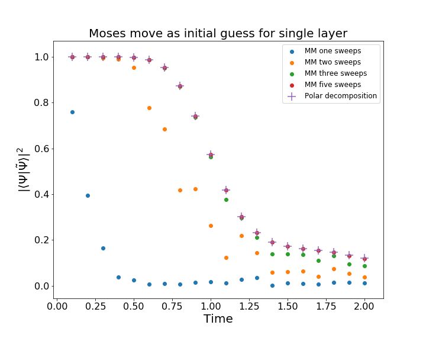
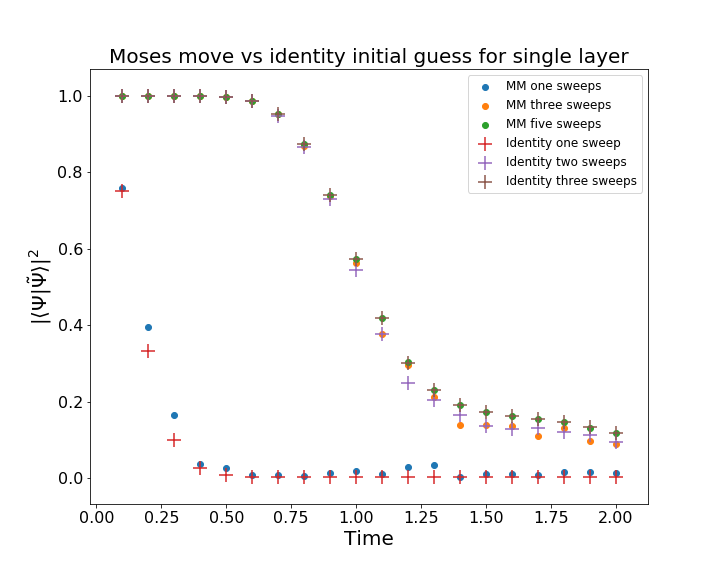
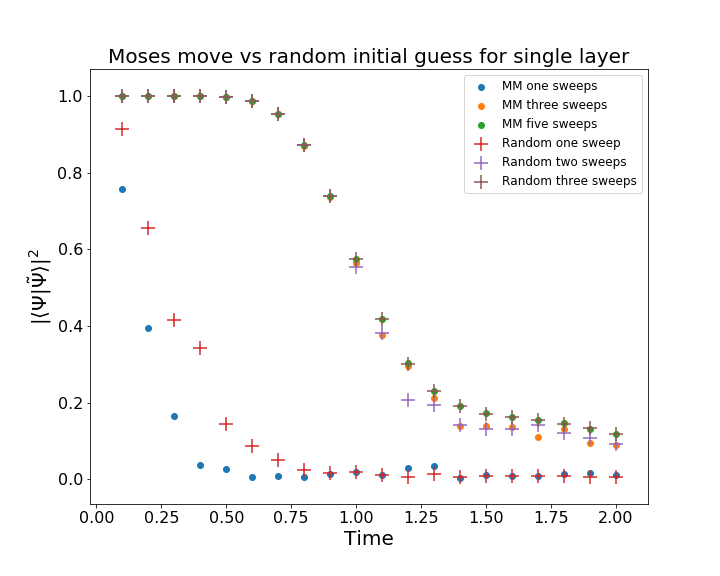

# Decomposing states using the Moses Move
This library uses the Moses Move (see https://arxiv.org/abs/1902.05100) to decompose an MPS into a low entanglement entropy MPS and a series of two site unitary gates. For the bulk of the code, see `state_approximation.py'. 

## Results
### Dimerized Heisenberg Model

### Sheng-Hsuan's wavefunctions
 

This is only for a single layer. Using the moses move as an initial guess does better than using the identity, but appears to converge slower than actually using the identity. This is a bit puzzling and makes me think there might be some bug somewhere. Also, though, this is only for a single layer, which I don't think is very representative.

## TODO
* Bug for complex wavefunctions -- it's unclear what the correct conjugations should be and I'm not sure why.
* Add the remaining images to README
* Benchmark on different states
* Experiment with more disentanglers

bond_dim_cut.png
brute_ee.png
brute_F.png
dimerized_heisenberg_nonvar.png
dimerized_heisenberg_var.png
mm_initial_guess.png
mm_v_id_initial_guess.png
T0.0.png
T0.1.png
T0.2.png
T0.3.png
T0.4.png
T0.5.png
T0.6.png
T0.7.png
T0.8.png
T0.9.png
T1.0.png
