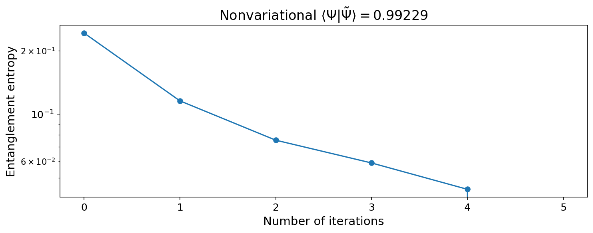

# Decomposing states using the Moses Move
This library uses the Moses Move (see https://arxiv.org/abs/1902.05100) to decompose an MPS into a low entanglement entropy MPS and a series of two site unitary gates. For the bulk of the code, see `state_approximation.py'. 

## Results
### Dimerized Heisenberg Model

The variational optimization (starting from the Moses Move guess) consistently
improves the fidelity with the original state.

## TODO
* Add the remaining images to README
* Benchmark on different states
* Experiment with more disentanglers
