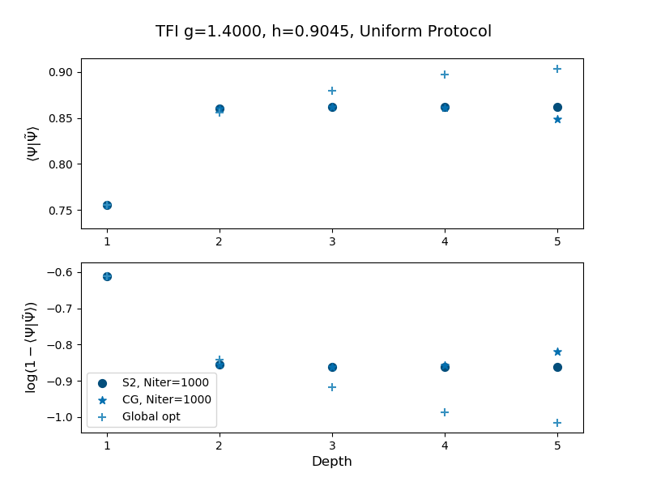

# Decomposing states using the Moses Move
This library uses the Moses Move (see https://arxiv.org/abs/1902.05100) to decompose an MPS into a low entanglement entropy MPS and a series of two site unitary gates. For the bulk of the code, see `state_approximation.py'. 

## Results
These results are benchmarked on the transverse field Ising model with a 
longitudinal field. The global optimization refers to Sheng-Hsuan's method which
iterates through all the unitary tensors (this method only does sequential 
optimizations).
### g=1.0000 h=0.0000
#### Disentangler comparison

#### Niter comparison

### g=1.4000 h=0.9045
#### Disentangler comparison

#### Niter comparison

